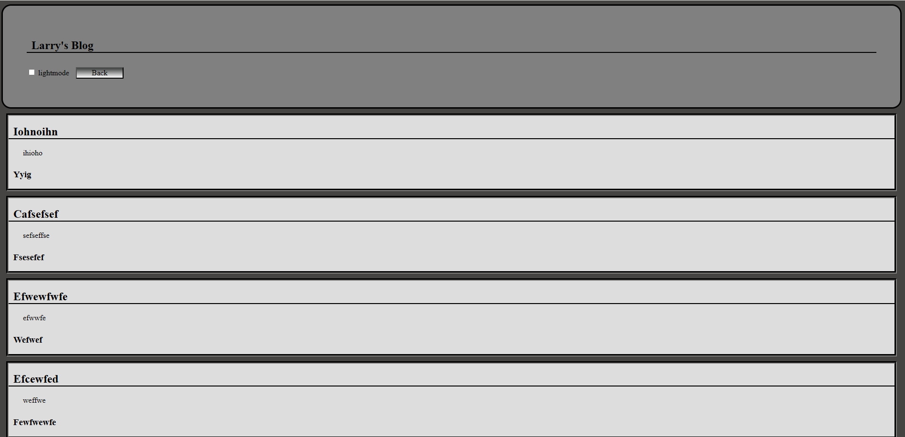

# Description
    
    This is a web application that saves and files employee information

## Usage

    - Post info on a blog page
    - Teach me slightly more advanced JS
    - Teach me how to use multiple webpages

## Credit

My friend Kip helped me with some of the JS and made sure i undertsood it

## License 

NA

# Pic

# Link
    
Website link
- https://lerielogin.github.io/Larrys-API-challenge/blog.html
